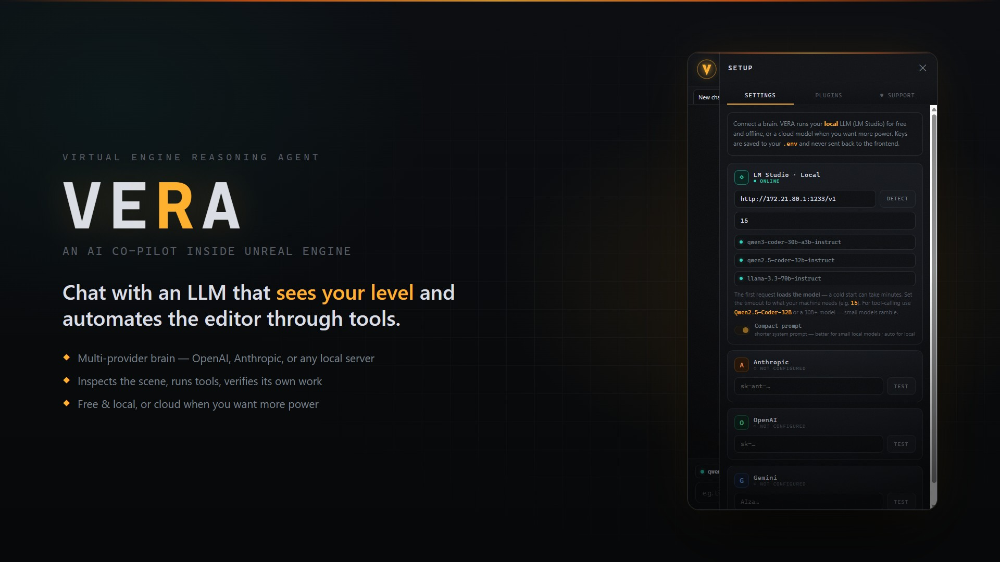
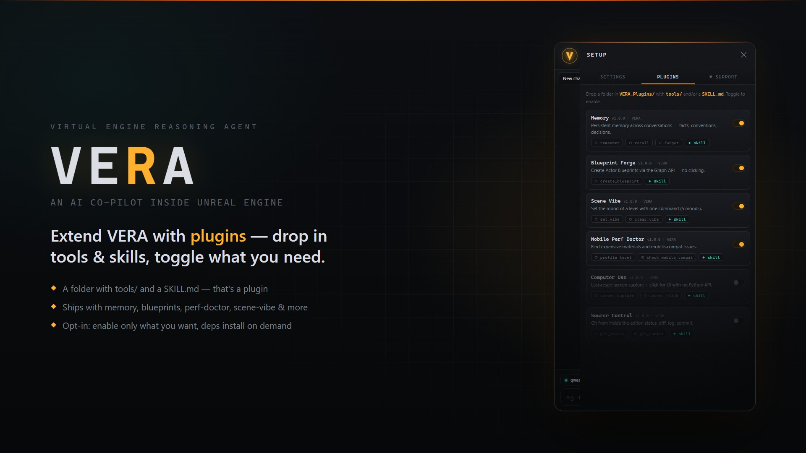
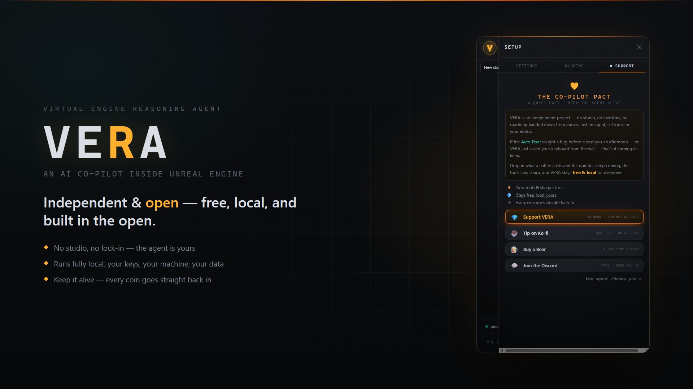

<div align="center">



# VERA — Virtual Engine Reasoning Agent

**An AI co-pilot that lives inside the Unreal Editor.**
Chat with an LLM that inspects your level, runs editor tools, sees the viewport,
and verifies its own work — powered by the brain *you* choose (cloud or fully local).

[](https://discord.gg/ZxG8wbRp)
[](https://www.patreon.com/maVERAick)
[](LICENSE)
[](https://www.unrealengine.com)
[](https://www.python.org)

</div>

> _A 10-second GIF of VERA working belongs right here — record one from the editor and drop it in `docs/images/`._

---

## Table of contents

- [Why VERA](#why-vera)
- [Features](#features)
- [The brain — bring your own LLM](#the-brain--bring-your-own-llm)
- [How it works](#how-it-works)
- [Built-in tools](#built-in-tools)
- [Plugins](#plugins)
- [MCP — drive the editor from Claude Code](#mcp--drive-the-editor-from-claude-code)
- [Install](#install)
- [Configuration](#configuration)
- [Usage](#usage)
- [Architecture](#architecture)
- [Contributing](#contributing)
- [Support — The Co-Pilot Pact](#support--the-co-pilot-pact)
- [License](#license)

---

## Why VERA

Most "AI for Unreal" tools are a chat box that hands you a snippet to paste. VERA is
an **agent**: you ask in plain language, and it *plans*, *calls the tools it needs*,
*looks at the result*, and *fixes things if something fails* — inside your editor.

- **Your brain, your rules.** OpenAI, Anthropic, Gemini, or **any local
  OpenAI-compatible server**. Run it 100% offline with a local model, or reach for a
  frontier model when you want more power. Keys live in your `.env` and never leave
  your machine.
- **It actually sees.** VERA renders the viewport (via `SceneCapture2D`, even with
  the editor minimized) and reasons over the image — to inspect an actor, judge an
  animation, or critique a composition.
- **It acts safely.** Read-only tools run freely; anything destructive asks for
  your approval first. A **Read** mode lets it look without touching anything.
- **It's extensible.** Capabilities ship as opt-in **plugins** — a folder with
  `tools/` and a `SKILL.md`. Write your own in minutes.
- **It's free & open.** MIT licensed, no studio, no lock-in.

## Features

| | |
|---|---|
| 🧠 **Multi-provider brain** | OpenAI · Anthropic · Gemini · any local OpenAI-compatible server (LM Studio, Ollama, llama.cpp, vLLM). Switch provider/model per tab, mid-conversation. |
| 🛰️ **Agentic tool loop** | Plans → calls tools → observes → self-corrects → verifies. Not a one-shot snippet generator. |
| 👁️ **Multimodal vision** | Captures the viewport / individual actors and feeds the image to the model. Paste, drag, or copy images into the chat too. |
| 🎞️ **Animation pipeline** | Build an IK rig, set up a retargeter, batch-retarget animations, play/scrub them, and visually verify — all from chat. |
| 🧩 **Plugin system** | Drop-in `tools/` + `SKILL.md`. Toggle per plugin. Per-plugin pip deps installed on demand. |
| 🔌 **MCP server** | Expose the editor to Claude Code (or any MCP client): exec Python, screenshot, tail logs, status, run a VERA command. |
| 🛡️ **Safety modes** | **Ask** (confirm destructive actions) · **Auto** (autopilot) · **Read** (inspect only). |
| 💬 **Polished chat UI** | Tabs, markdown + syntax highlighting, inline screenshots, slash-command menu, live tool narration, stop button, conversation windowing. |
| ⚙️ **Turnkey setup** | First launch auto-installs its Python deps. Configure providers, local URL, and request timeout right in the panel. |
| 🖥️ **Cross-platform** | Windows, macOS, Linux. No hardcoded paths. |

## The brain — bring your own LLM

VERA speaks the **OpenAI `/v1` standard**, so it works with essentially any backend:

| Provider | What you need |
|---|---|
| **OpenAI** | `OPENAI_API_KEY` |
| **Anthropic** | `ANTHROPIC_API_KEY` |
| **Gemini** | `GEMINI_API_KEY` (Google's OpenAI-compatible endpoint) |
| **Local** | `VERA_LOCAL_BASE_URL` → your server's `/v1` URL (LM Studio `:1234`, Ollama `:11434`, llama.cpp, vLLM…) — **no key, no cloud, no cost** |

> 💡 VERA is an **agent**, so the model needs solid tool-calling. For local, use a
> **30B+ coder model** (e.g. Qwen2.5/3-Coder-32B); small models ramble. The first
> request to a cold local server loads the model — which can take minutes — so the
> request **timeout is configurable** right in Setup.

## How it works

```
You ──▶ VERA chat (Qt/WebEngine UI inside the editor)
            │  command + selected provider/model/mode
            ▼
        AgentLoop  ─────────────────────────────────────┐
            │  1. ask the LLM (your provider) for a plan │
            │  2. LLM requests a tool                    │  repeat until done
            │  3. run the tool (gate if destructive) ────┤
            │  4. feed the result back to the LLM        │
            └─▶ 5. final answer ─────────────────────────┘
                         │
                         ▼
              Unreal Editor (Python bridge → the `unreal` API)
```

Every turn streams to the UI: you see the plan, each tool call, and the result as
it happens — and you can **Stop** at any point.

## Built-in tools

The agent ships with a core toolset (read-only tools need no approval; ✋ = gated):

| Tool | What it does |
|---|---|
| `inspect_level` | Read the open level: actor counts, classes, lights, static meshes. |
| `inspect_actor_animability` | Check whether an actor has a skeleton and can be animated. |
| `capture_actor` | Render an actor/viewport to an image so VERA can **see** it (works minimized). |
| `animate_actor` | Apply or scrub an animation on a skeletal actor. ✋ |
| `ensure_ik_rig` | Create/ensure an IK Rig for a skeleton. ✋ |
| `ensure_retargeter` | Create/ensure an IK Retargeter between skeletons. ✋ |
| `retarget_animations` | Batch-retarget animations between skeletons. ✋ |
| `run_ue_python` | Run arbitrary Python against the `unreal` API — the universal escape hatch. ✋ (asks every call) |

Chained together, the animation tools are a full **rig → retarget → animate →
visually verify** pipeline, driven entirely from chat.

## Plugins

<div align="center">



</div>

Capabilities ship as **opt-in plugins** so the core stays lean — you enable only what
you want, and a plugin's pip dependencies are pulled in on demand. Bundled plugins:

| Plugin | What it adds |
|---|---|
| **Memory** | Persistent memory across conversations — facts, conventions, decisions. |
| **Blueprint Forge** | Create Actor Blueprints via the Graph API (components, compile, save) — no clicking. |
| **Project Intelligence** | Read-only analysis of the on-disk project: engine, plugins, assets. |
| **Project Playbook** | Loads this project's conventions, decisions and known traps into context. |
| **Mobile / Performance Doctor** | Audits materials and mobile-compat issues; profiles the level. |
| **Scene Vibe** | Sets the cinematic mood of a level for showcase shots (5 presets). |
| **Source Control** | Git from inside the editor: status, diff, log, and gated commits. |
| **Local IQ** | A disciplined plan → act → verify loop that raises a small local model's effective IQ. |
| **Computer Use** | Last-resort screen capture + click for editor UI with no Python API (off by default). |

### Write your own plugin

```
VERA_Plugins/my-plugin/
├── plugin.json        # {"name","version","enabled", optional "deps":[...]}
├── tools/*.py         # Tool subclasses (name, description, input_schema, execute)
└── SKILL.md           # when/how VERA should use it (injected into the system prompt)
```

A minimal tool:

```python
from vera.agent.tool import Tool, ToolResult

class HelloTool(Tool):
    name = "say_hello"
    description = "Say hello. Use when the user greets VERA."
    input_schema = {"type": "object", "properties": {"to": {"type": "string"}}}
    def execute(self, args, ctx):
        return ToolResult(f"Hello, {args.get('to', 'world')}!")
```

Drop the folder in `VERA_Plugins/`, toggle it on in the **Plugins** tab — done.

## MCP — drive the editor from Claude Code

VERA ships an [MCP](https://modelcontextprotocol.io) server, so external agents
(Claude Code, or any MCP client) can drive your editor:

| MCP tool | Purpose |
|---|---|
| `ue_exec` | Execute Python in the editor and get the output back. |
| `ue_screenshot` | Capture the viewport. |
| `ue_log` | Tail the Unreal output log. |
| `ue_status` | Check the bridge/editor status. |
| `vera_command` | Run a full natural-language VERA command (the agent pipeline). |

## Install

### From source (developers)

```bash
git clone <this-repo>
```

1. Open the `UE57` project, **or** drop the built plugin into your own project's
   `Plugins/` folder.
2. Enable Unreal's **Python Editor Script Plugin**.
3. Open **VERA** from the editor toolbar. On first launch it **auto-installs** its
   Python dependencies (one time) — no console magic.
4. In **Setup ⚙**, pick a provider and paste a key (or a local server URL), then chat.

### Build the distributable plugin (UE 5.7)

```bash
python PackageVERA.py        # assemble from source + bundle deps + RunUAT + zip → Packaged/
```

The output is a **compiled, drag-and-drop plugin** ready for the Epic Games Launcher
/ Fab. Want another engine version? Clone and build it yourself — the pipeline targets
the latest UE.

### Requirements

- Unreal Engine **5.7** (latest)
- The **Python Editor Script Plugin** (bundled with UE)
- Internet access **only** if you use a cloud provider (local models run fully offline)

## Configuration

VERA reads a `.env` at the repo root (and the Setup panel writes to it for you):

| Variable | Meaning |
|---|---|
| `OPENAI_API_KEY` / `ANTHROPIC_API_KEY` / `GEMINI_API_KEY` | Cloud provider keys |
| `VERA_LOCAL_BASE_URL` | Local server `/v1` URL (e.g. `http://localhost:1234/v1`) |
| `VERA_LLM_TIMEOUT_S` | Request timeout in seconds (raise it for slow cold starts) |
| `VERA_PLUGINS_DIR` | Override the plugins directory |
| `VERA_AUTO_APPROVE` | Skip the destructive-action gate (autopilot/testing) |

> 🔒 Keys are saved to your `.env` and **never** sent back to the frontend.

## Usage

Open the VERA panel and just ask. A few things to try:

- *"How many actors are in this level, and how many are lights?"*
- *"Create a `BP_SpikeTrap` Blueprint with a static mesh and a box collision."*
- *"Retarget these animations from the UE4 mannequin to my character, then show me the idle."*
- *"Audit this level for mobile performance issues."*
- *"Set a horror vibe on the scene for a screenshot."*
- *"Remember that this project uses the `SM_` prefix for static meshes."*

Switch **Ask / Auto / Read** in the composer to control how much freedom VERA has.

## Architecture

```
┌─────────────────────────── Unreal Editor ───────────────────────────┐
│                                                                      │
│   VERA panel (Qt WebEngine UI)  ◀──┐                                 │
│        │ command                   │ events (stream)                 │
│        ▼                           │                                 │
│   vera_server  ──▶  AgentLoop  ──▶ tools ──▶ Python bridge ──▶ unreal│
│        │                │                                            │
│        │                └─ plugins (VERA_Plugins/*)                  │
│        ▼                                                             │
│   MCP server  ◀── Claude Code / other MCP clients                   │
└──────────────────────────────────────────────────────────────────────┘
            ▲
            └─ LLM provider (OpenAI / Anthropic / Gemini / local)
```

- **`vera/agent/`** — the AgentLoop, tool registry, sessions, the multi-provider client.
- **`vera/llm/`** — the OpenAI-compatible adapter (duck-types the Anthropic surface).
- **`vera/tools/`** — the MCP server and the UE socket connection.
- **`vera/core/`** — the editor server (`vera_server`) and the progress blackboard.
- **`UE57/Content/Python/`** — the editor scripts + the chat UI (`vera_chat/`).
- **`UE57/VERA_Plugins/`** — the studio plugins.

## Contributing

Contributions are welcome — new tools, plugins, providers, fixes.

```bash
# run the test suite
python -m pytest tests/ -q
```

- **Add a tool:** create a `Tool` subclass in `vera/agent/tools/` — the registry
  discovers it automatically.
- **Add a plugin:** see [Write your own plugin](#write-your-own-plugin).
- **Add a provider:** extend the registry in `vera/agent/models.py`.

The codebase is Python + a thin C++ editor module, fully cross-platform, and covered
by a test suite. Open an issue or a PR, or come chat in
[Discord](https://discord.gg/ZxG8wbRp).

## Support — The Co-Pilot Pact

<div align="center">



</div>

VERA is **independent and open** — no studio, no investors, no lock-in. It's free and
runs on your own keys and hardware. If it earns its keep, you can keep it alive:

- 💎 **[Support on Patreon](https://www.patreon.com/maVERAick/gift)** — monthly or a one-off gift
- ☕ **[Tip on Ko-fi](https://ko-fi.com/maveraick)** · 🍺 **[Buy a Beer](https://buymeacoffee.com/maveraick)**
- 💬 **[Join the Discord](https://discord.gg/ZxG8wbRp)** — free, come say hi
- ⭐ **Star the repo** and tell another dev — it genuinely helps.

## License

MIT — use VERA in your commercial and AAA projects. See [LICENSE](LICENSE).

## Credits

Conjured in the dark by **maVERAick** — Sith Lord of the Unreal Editor — mortal
identity [**@ezesubu**](https://github.com/ezesubu). ⚡🌑

> _Come to the dark side. We have agents._

<div align="center">
<sub>built by <b>maVERAick</b> · <i>the agent thanks you ◇</i></sub>
</div>
